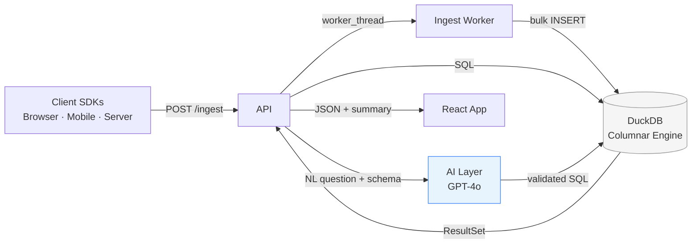

# Product Analytics Copilot

**Self-hosted product analytics with a conversational AI layer.** Ask questions about your users in plain English; get SQL-backed answers in seconds — no dashboards to build, no data team to wait on.

```
"How many users completed onboarding last week, broken down by plan?"

→ 1,247 users completed onboarding — up 12% from the prior week.
  Pro plan: 834 (67%)  |  Starter: 341 (27%)  |  Free: 72 (6%)
```

---

## Architecture



See [`docs/architecture.md`](docs/architecture.md) for full C4 diagrams, sequence flows, and scalability analysis.

---

## Why this exists

Most analytics tools force a choice:

- **SaaS (Mixpanel, Amplitude):** Powerful but expensive, black-box, and your data lives on someone else's servers.
- **DIY warehouse stack:** Full control but requires a data engineer, dbt models, and a BI layer before a PM can answer a question.
- **Lightweight tools (Plausible, Umami):** Privacy-respecting but SQL-free and limited in depth.

Product Analytics Copilot occupies a different position: **the analytical power of a warehouse stack, the ease of a SaaS tool, running on your own infrastructure in under 10 minutes.**

The AI copilot is the core UX differentiator. Rather than navigating a query builder, users express intent in natural language. The AI generates DuckDB SQL, which is validated, executed, and narrated — all in < 3 seconds.

---

## Feature Set

| Feature | Status |
|---|---|
| Event ingestion (batch API, SDK-compatible) | ✅ |
| DuckDB-powered OLAP queries (< 200ms on 10M rows) | ✅ |
| Natural language → SQL via GPT-4o | ✅ |
| Query result narration (plain English summary) | ✅ |
| Interactive query builder (SQL editor) | ✅ |
| Saved queries with version history | ✅ |
| Drag-and-drop dashboards | ✅ |
| Chart types: line, bar, area, pie, metric, funnel, heatmap | ✅ |
| Multi-project / workspace isolation | ✅ |
| Public dashboard share links | ✅ |
| Parquet export to S3 (cold storage) | 🚧 v1.1 |
| Real-time event stream (WebSocket) | 🚧 v1.1 |
| Session replay integration | 📋 Backlog |
| dbt model import | 📋 Backlog |

---

## Tech Stack

### Frontend (`packages/web`)
| | |
|---|---|
| Framework | React 18 + Vite 5 + TypeScript |
| Styling | TailwindCSS 3 + shadcn/ui |
| Server state | TanStack Query (React Query) v5 |
| Client state | Zustand 4 |
| Charts | Recharts 2 |
| SQL editor | CodeMirror 6 |

### Backend (`packages/api`)
| | |
|---|---|
| Runtime | Node.js 20 LTS |
| Framework | Express 4 + TypeScript |
| Analytics DB | DuckDB 1.x (via `duckdb-node`) |
| Operational DB | PostgreSQL 16 |
| ORM | Drizzle ORM |
| AI | OpenAI SDK (gpt-4o) |
| Real-time | `ws` WebSocket |
| Auth | JWT + bcrypt |

### Infrastructure
| | |
|---|---|
| Monorepo | Turborepo + pnpm workspaces |
| Containers | Docker + Docker Compose |
| CI | GitHub Actions |
| Migrations | drizzle-kit |

---

## Getting Started

### Prerequisites

- Node.js 20+
- pnpm 9+
- Docker (for PostgreSQL)
- OpenAI API key

### 1. Clone and install

```bash
git clone https://github.com/your-org/product-analytics-copilot
cd product-analytics-copilot
pnpm install
```

### 2. Configure environment

```bash
cp .env.example .env
# Edit .env — minimum required:
#   OPENAI_API_KEY=sk-...
#   DATABASE_URL=postgresql://...
#   JWT_SECRET=<random 32+ char string>
```

### 3. Start infrastructure

```bash
docker compose up -d postgres
pnpm db:migrate
```

### 4. Seed development data

```bash
pnpm seed
# Generates 100,000 realistic analytics events across 3 demo projects
# Includes: e-commerce funnel, SaaS onboarding, mobile app engagement
```

### 5. Run all services

```bash
pnpm dev
# API:  http://localhost:3001
# Web:  http://localhost:5173
```

Log in with the seeded admin account: `demo@example.com` / `demo1234`

---

## Project Structure

```
product-analytics-copilot/
├── packages/
│   ├── web/          # React SPA (Vite + TypeScript)
│   ├── api/          # Express API + DuckDB + AI layer
│   └── shared/       # Shared types, validation schemas, utilities
├── docs/
│   ├── architecture.md     # System design, C4 diagrams, trade-offs
│   ├── data-model.md       # Full schema reference
│   ├── ai-prompt-design.md # Prompt engineering strategy
│   └── trade-offs.md       # Decision log (Option A vs B format)
├── scripts/
│   ├── seed-data.ts  # Generate 100k+ mock events
│   └── dev.sh        # Orchestrate local dev services
├── turbo.json
├── docker-compose.yml
└── .env.example
```

---

## Documentation

| Doc | Description |
|---|---|
| [Architecture](docs/architecture.md) | System overview, C4 diagrams, data flow, scalability analysis |
| [Data Model](docs/data-model.md) | DuckDB event schema, PostgreSQL operational schema, ER diagram |
| [AI Prompt Design](docs/ai-prompt-design.md) | NL→SQL prompt templates, few-shot examples, guardrails, evaluation |
| [Trade-offs](docs/trade-offs.md) | 7 architectural decisions with Option A/B analysis |

---

## Screenshots

<!-- TODO: Add screenshots after initial UI implementation -->
<!-- Suggested shots:
  1. Dashboard with DAU chart, funnel widget, and metric cards
  2. AI copilot asking "Which features drive upgrade?" with SQL expansion
  3. Query builder with live result table and chart toggle
  4. Dashboard edit mode with drag-and-drop widgets
-->

---

## Ingest API

Track events from any language or SDK:

```bash
curl -X POST https://your-instance.com/v1/ingest \
  -H "Authorization: Bearer wk_your_write_key" \
  -H "Content-Type: application/json" \
  -d '{
    "batch": [
      {
        "event": "button_clicked",
        "userId": "user_123",
        "timestamp": "2025-03-26T12:00:00Z",
        "properties": {
          "component": "upgrade_modal",
          "plan": "pro"
        }
      }
    ]
  }'
```

Segment-compatible `/track` endpoint available for drop-in migration.

---

## Contributing

```bash
pnpm test          # Run all package tests
pnpm lint          # ESLint + TypeScript type-check
pnpm build         # Production build (all packages)
```

See [CONTRIBUTING.md](CONTRIBUTING.md) for branch conventions and PR guidelines.

---

## License

MIT — see [LICENSE](LICENSE).
