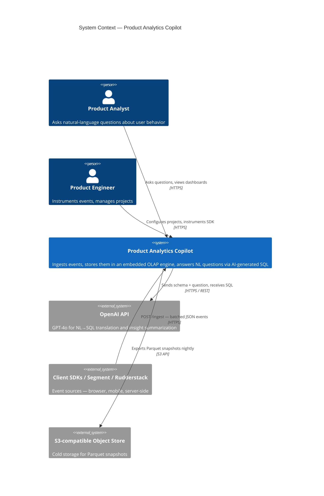
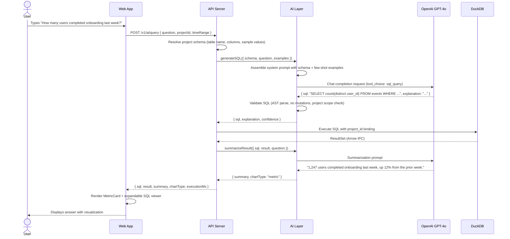

# Architecture: Product Analytics Copilot

## 1. System Overview

Product Analytics Copilot is a self-hosted analytics platform that combines an embedded OLAP engine (DuckDB) with a conversational AI layer, enabling product teams to query millions of behavioral events in natural language without writing SQL or waiting on a data team.

### C4 Context Diagram



### C4 Container Diagram

```mermaid
C4Container
    title Container Diagram — Product Analytics Copilot

    Container(web, "Web App", "React 18 / Vite / TypeScript", "SPA — query builder, dashboards, AI chat interface")
    Container(api, "API Server", "Node.js / Express / TypeScript", "REST + WebSocket. Handles auth, ingest, query execution, AI orchestration")
    ContainerDb(duckdb, "Query Engine", "DuckDB (embedded)", "In-process OLAP. Holds hot events as Parquet; queries execute in <200ms on 10M rows")
    ContainerDb(pg, "Operational DB", "PostgreSQL", "Projects, users, saved queries, dashboard metadata, API keys")
    Container(ai, "AI Layer", "OpenAI SDK / LangChain-lite", "Prompt construction, SQL generation, result summarization, guardrails")
    Container(worker, "Ingest Worker", "Node.js worker_threads", "Validates, normalises, and bulk-inserts batched events into DuckDB")

    Rel(web, api, "REST + WS", "JSON / HTTPS")
    Rel(api, duckdb, "Direct FFI via duckdb-node", "In-process")
    Rel(api, pg, "pg / node-postgres", "TCP")
    Rel(api, ai, "function call", "in-process module")
    Rel(api, worker, "worker_threads MessageChannel", "structured clone")
    Rel(ai, openai, "OpenAI SDK", "HTTPS")
```

---

## 2. Data Flow

```
Client SDKs
    │  POST /v1/ingest  (batch, up to 500 events)
    ▼
┌─────────────────────────────────┐
│  Ingest Worker (worker_thread)  │
│  • Schema validation            │
│  • Property coercion / trim     │
│  • Dedup on (project_id, uuid)  │
│  • Bulk INSERT → DuckDB         │
└────────────────┬────────────────┘
                 │ DuckDB WAL / Parquet
                 ▼
┌─────────────────────────────────┐
│  DuckDB Query Engine            │
│  • events table (columnar)      │
│  • Materialized views:          │
│    - daily_active_users         │
│    - funnel_steps               │
│    - retention_cohorts          │
└────────────────┬────────────────┘
                 │ SQL ResultSet
                 ▼
┌─────────────────────────────────┐
│  API Server                     │
│  • Query auth + project scoping │
│  • Result serialization (Arrow) │
│  • Cache headers / ETag         │
└──────┬──────────────┬───────────┘
       │              │
       ▼              ▼
  REST Response   AI Layer
  (saved query,   • Prompt assembly
   dashboard)     • SQL generation
                  • Result summary
                       │
                       ▼
                  Web App
                  • Chart rendering (Recharts)
                  • NL answer display
                  • Dashboard persistence
```

---

## 3. Component Boundaries

| Component | Responsibility | Does NOT own |
|---|---|---|
| **web** | Render, user interaction, optimistic UI, cache invalidation | Business logic, query auth |
| **api** | Auth, project scoping, HTTP contract, WebSocket push | SQL dialect, chart type selection |
| **query-engine (DuckDB)** | Fast columnar scan, aggregations, window functions | Schema validation, access control |
| **ai-layer** | Prompt construction, SQL generation, hallucination guardrails, result narration | Query execution, data storage |
| **ingest-worker** | Event validation, normalisation, bulk write | Query serving, dashboards |

The AI layer is intentionally a thin orchestration module — it receives a structured schema and user intent, calls the LLM, validates the returned SQL (explain plan + structural checks), and hands the query back to the query engine. It has no direct DuckDB access; this prevents prompt-injected DROP TABLE / UPDATE attempts.

---

## 4. Technology Choices & Trade-off Rationale

### 4.1 DuckDB over PostgreSQL for Analytics

**Chosen:** DuckDB embedded
**Alternative:** PostgreSQL with TimescaleDB or Citus

| Factor | DuckDB | PostgreSQL |
|---|---|---|
| Aggregation on 10M rows | ~80ms (vectorised) | ~2–8s (row-store) |
| Deployment complexity | Zero — in-process | Separate daemon, connection pool |
| OLAP query patterns | Native: GROUPING SETS, QUALIFY, Parquet scan | Possible but unnatural |
| Concurrent OLTP writes | WAL; single-writer limitation | MVCC, excellent |
| Operational maturity | 1.0 (2024) — newer | 30+ years |

**Decision:** Analytics read patterns (full-column scans, wide aggregations) are DuckDB's strength. We accept the single-writer limitation because ingest is batched through a single worker thread anyway. At 100M+ events we export to S3 Parquet and query via DuckDB's `read_parquet()` — same query interface, zero migration.

### 4.2 React Query over Redux / Zustand for Server State

**Chosen:** TanStack Query (React Query) v5 for all server state
**Alternative:** Redux Toolkit Query or raw `useEffect`

React Query handles cache invalidation, background refetch, deduplication of in-flight requests, and loading/error states declaratively. Redux adds serialization ceremony for no benefit when the data lives on a server. Zustand is retained for **UI-only** ephemeral state (active panel, drawer open, selected chart type).

### 4.3 Vite over Next.js

The app is an authenticated SPA — there is no SEO requirement, no server-rendered marketing pages, and no need for edge functions. Next.js would add ~60% more build complexity (App Router, RSC, route handlers) with zero benefit. Vite provides sub-second HMR and a simpler mental model.

### 4.4 Turborepo over Nx

Turborepo's incremental build cache and minimal configuration surface area fit a monorepo of this size. Nx's plugin ecosystem and code-generation become valuable at 10+ packages; we're at 3. Migration path is straightforward as the repo grows.

### 4.5 OpenAI SDK (direct) over LangChain

LangChain adds 15+ transitive dependencies and a DSL that obscures what prompts are actually sent. For a focused NL→SQL task with well-defined schema, direct SDK calls with explicit prompt templates give us full control over token budgets, retries, and observability. If we add RAG over a knowledge base, we can adopt LangChain's retrieval chains selectively.

---

## 5. Scalability

### 5.1 At 1M Events (current target)

- Single DuckDB file, in-process. All queries < 500ms.
- Single API server process. Ingest worker is a worker_thread.
- No separate caching layer needed — React Query client cache + DuckDB's columnar page cache covers hot queries.

### 5.2 At 10M Events

- DuckDB file reaches ~2GB. Enable `memory_limit` and `threads` tuning.
- Add Redis for query result cache (keyed on SQL hash + project_id + time range). TTL 5 min for dashboard queries.
- Add read replica: DuckDB opened read-only in a second process for query serving; WAL applies on writer.

### 5.3 At 100M Events

- Parquet export strategy: daily cron exports yesterday's events to S3 as `s3://bucket/events/project_id=X/date=YYYY-MM-DD/*.parquet`.
- API layer switches to `duckdb.connect(':memory:')` + `ATTACH S3 parquet` for historical queries.
- Hot (last 7 days) data stays in DuckDB local file for sub-100ms queries.
- Consider MotherDuck (managed DuckDB) or Apache Iceberg catalog for multi-tenant isolation.
- Add a job queue (BullMQ + Redis) to handle AI query generation async, with WebSocket push when results are ready.

### 5.4 At 1B Events

- Graduate to Apache Arrow Flight + DuckDB on compute-optimised instances.
- Object store becomes primary. DuckDB becomes the query engine against Parquet/Iceberg; no local writes.
- AI query generation moves to a separate service with its own rate-limit budget.

---

## 6. Sequence Diagram: Natural Language Query



---

## 7. Non-Functional Requirements

| Attribute | Target | Mechanism |
|---|---|---|
| Query p95 latency | < 500ms (10M events) | DuckDB columnar + result cache |
| Ingest throughput | 5,000 events/sec sustained | Batched worker_thread writes |
| AI query latency | < 3s end-to-end | GPT-4o turbo, streaming summary |
| Availability | 99.5% (self-hosted single node) | PM2 cluster mode, healthcheck endpoint |
| Data isolation | Strict per-project row filtering | All DuckDB queries bind `project_id` param |
| SQL injection prevention | AI-generated SQL validated via AST | `node-sql-parser` structural validation before execution |
